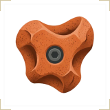
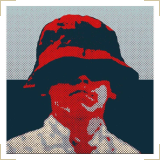
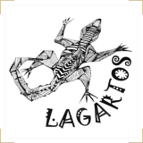
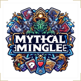

<picture>
  
</picture>

  <strong><samp>Ingeniero del Software centrado en DevOps y automatización de procesos</samp></strong>

  <samp>Me considero un apasionado por la informática y la tecnología. Cuento con experiencia en desarrollo, automatización, entornos ágiles y administración de sistemas Linux. Mi interés principal se encuentra en aplicar bases de DevOps para la automatización de flujos y mejora de la eficiencia.</samp>

---

## <samp>ENLACES</samp>

  <samp>
    <a href="mailto:nachomelendo@gmail.com">[ Email]</a> &nbsp;&nbsp;
    <a href="https://www.linkedin.com/in/melendo/">[ LinkedIn]</a> &nbsp;&nbsp;
    <a href="https://github.com/Melendo">[ GitHub]</a> &nbsp;&nbsp;
    <a href="https://www.youtube.com/@nachomelendo3930">[ YouTube]</a>
  </samp>

---

<picture>
  
</picture>

  <strong><samp>Listado de los proyectos más relevantes que he realizado.</samp></strong>

---

<small><samp>APLICACIÓN WEB PROGRESIVA</samp></small>

<h3><strong><samp>CLIMBIT</samp></strong></h3>

<samp>ClimbIt es una Aplicación Web Progresiva (PWA) orientada a la gestión de rocódromos y al registro de sesiones de escalada. Nacida como Trabajo de Fin de Grado, permite a los usuarios gestionar su perfil y medir detalladamente su progreso, fomentando así la competición entre amigos.</samp>

<samp>· JavaScript &nbsp;· PWA &nbsp;· SPA &nbsp;· Docker &nbsp;· PostgreSQL</samp>

<a href="https://melendo.dev/projects/climbit/">[<samp>Más información</samp>]</a>
 

---

<small><samp>BOT DE DISCORD</samp></small>

<h3><strong><samp>BOTMERIENDO</samp></strong></h3>

<samp>Bot de música y utilidades para Discord, modularizado y listo para desplegar de forma sencilla con Docker. Permite la reproducción de música desde YouTube, control de colas y optimización de recursos mediante auto-desconexión.</samp>

<samp>· Python &nbsp;· Docker &nbsp;· Discord</samp>

<a href="https://melendo.dev/projects/botmeriendo/">[<samp>Más información</samp>]</a>
 

---

<small><samp>APLICACIÓN MÓVIL</samp></small>

<h3><strong><samp>KEEPERLY</samp></strong></h3>

<samp>Keeperly es una aplicación móvil nativa para Android diseñada para simplificar y automatizar la gestión de finanzas personales. Resuelve el problema del registro manual tedioso de gastos mediante la sincronización automatizada con cuentas de PayPal Sandbox, permitiendo a los usuarios planificar presupuestos personalizados, organizar transacciones y realizar un seguimiento claro de sus metas financieras en tiempo real.</samp>

<samp>· Java &nbsp;· Android</samp>

<a href="https://melendo.dev/projects/keeperly/">[<samp>Más información</samp>]</a>
 

---

<small><samp>PÁGINA WEB</samp></small>

<h3><strong><samp>WEB DEL CLUB LAGARTOS</samp></strong></h3>

<samp>Sitio web oficial del **Club Lagartos**, una plataforma digital responsiva y moderna diseñada para centralizar la información de sus tres pilares deportivos principales: la Escuela Deportiva, el equipo de Trail Running y el Rally MTB. Resuelve la necesidad de comunicación y captación del club ofreciendo una experiencia de usuario premium e inmersiva.</samp>

<samp>· HTML &nbsp;· CSS &nbsp;· JavaScript</samp>

<a href="https://melendo.dev/projects/web-del-club-lagartos/">[<samp>Más información</samp>]</a>
 

---

<small><samp>PORTFOLIO WEB</samp></small>

<h3><strong><samp>PORTFOLIO DE FOTOGRAFÍA - PABLODLP</samp></strong></h3>

<samp>Sitio web personal y portfolio profesional de Pablo de la Puerta (PabloDLP), fotógrafo especializado en deportes de alto rendimiento, naturaleza y paisajes. Ofrece una galería interactiva y moderna para mostrar su trabajo visualmente impactante.</samp>

<samp>· HTML &nbsp;· CSS &nbsp;· JavaScript</samp>

<a href="https://melendo.dev/projects/portfolio-de-fotografia-pablodlp/">[<samp>Más información</samp>]</a>
 

---

<small><samp>CARTA WEB </samp></small>

<h3><strong><samp>SALNAYA</samp></strong></h3>

<samp>Menú digital interactivo y responsive para la Cafetería Salnaya, diseñado para ofrecer una visualización clara y moderna de la oferta gastronómica del establecimiento con soporte para modo oscuro.</samp>

<samp>· HTML &nbsp;· CSS &nbsp;· JavaScript</samp>

<a href="https://melendo.dev/projects/salnaya/">[<samp>Más información</samp>]</a>
 

---

<small><samp>VIDEOJUEGO WEB</samp></small>

<h3><strong><samp>MYTHICALMINGLE</samp></strong></h3>

<samp>Mythical Mingle es una plataforma web interactiva y nostálgica que revive la clásica tradición de coleccionar álbumes de cromos. A través de la apertura de sobres virtuales, trivias educativas para ganar monedas y el intercambio de cromos con amigos, los usuarios pueden completar colecciones temáticas en un entorno digital moderno y social.</samp>

<samp>· HTML &nbsp;· CSS &nbsp;· JavaScript</samp>

<a href="https://melendo.dev/projects/mythicalmingle/">[<samp>Más información</samp>]</a>
 

